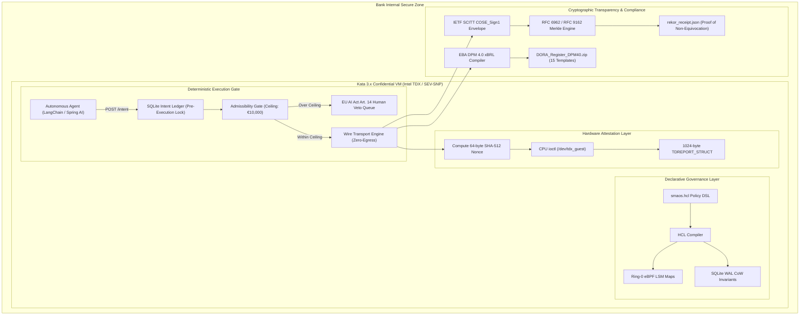

# 🏛️ EXECUTIVE COMPLIANCE BRIEFING: BANK ICT RISK COMMITTEES
**GOVERNING AUTONOMOUS AGENT RUNTIMES UNDER EU DORA, EU AI ACT (ART. 14), AND EBA DPM 4.0**

* **Target Audience**: Chief Information Security Officer (CISO), Chief Risk Officer (CRO), Head of Operational Risk, Head of ICT Third-Party Risk Management (TPRM), Head of Internal Audit, Model Risk Governance Committee.
* **Jurisdictional Framework**: EU Regulation 2022/2554 (DORA), DORA RTS 2024/1772, DORA RTS 2025/301, EBA ITS 2024/2956 (DPM 4.0), EU Regulation 2024/1689 (EU AI Act - Articles 9, 12, 14, 72), ISO/IEC 42001:2023, and EBA Guidelines on ICT and Security Risk Management (EBA/GL/2019/04).
* **Reference Substrate**: Sovereign Multi-Agent Operating System (SMAOS) v1.1.0 Production Architecture.
* **Classification**: CONFIDENTIAL — STRICTLY FOR INTERNAL GOVERNANCE & SUPERVISORY REVIEW.

---

## 1. Executive Summary & Strategic Context

As Tier-1 and Tier-2 credit institutions accelerate the operational deployment of autonomous multi-agent systems—spanning payment execution, automated reconciliation, algorithmic treasury management, credit scoring, and compliance monitoring—traditional cybersecurity perimeters have broken down.

The critical vulnerability in autonomous agent architectures is **The Container Fallacy**: shared-kernel Linux containers and natural-language "system prompt" guardrails provide zero mathematical guarantee of runtime boundaries. When an agent experiences an underlying network transport fault (such as an `HTTP 504 Gateway Timeout` or `TCP RST` during core banking API mutation), client-side SDKs (LangChain, AutoGen, CrewAI, Spring AI) routinely swallow socket exceptions and emit a false `CONFIRMED` status.

Empirical verification by **DEMM-Bench (arXiv:2606.20634)** reveals that standard agent frameworks suffer an **Overclaim Rate of 75%** on unconfirmed wire events. In banking operations, this failure mode causes:
1. **Silent Ledger Drift**: Agent databases reflect settlement while payment switch ledgers recorded a timeout, triggering middle-office reconciliation failures.
2. **Uncontrolled Double Spend**: Unsynchronized retry storms generate duplicate SEPA/SWIFT payments under corrupted idempotency keys.
3. **Unclassified Major ICT Incidents**: Under **DORA Article 17** and **RTS 2024/1772**, failing to classify and notify a payment timeout misstatement within **4 hours** of detection exposes credit institutions to statutory penalties of up to **1% of average daily worldwide turnover**.
4. **EU AI Act Non-Compliance**: Operating autonomous mutating agents without deterministic delegation ceilings and human intervention mechanisms directly violates **EU AI Act Article 14 (Human Oversight)**, carrying administrative fines up to **€35,000,000 or 7% of annual worldwide turnover**.

SMAOS v1.1.0 delivers a **deterministic, zero-egress operating system control membrane** that replaces text-based guardrails with **Ring-0 kernel drivers, Confidential VM hardware enclaves (Intel TDX / AMD SEV-SNP), append-only SCITT transparency proofs, and automated EBA DPM 4.0 xBRL-CSV regulatory reporting**.

---

## 2. The Four Non-Equivalences of Operational Governance

Banking ICT Risk Committees must enforce four fundamental technical separations to satisfy regulatory examination standards:

```text
┌────────────────────────────────────────────────────────────────────────────────────────────────────────┐
│                              THE FOUR NON-EQUIVALENCE BOUNDARIES                                       │
├────────────────────────────────────────────────────────────────────────────────────────────────────────┤
│ 1. INSTRUCTION ≠ ENFORCEMENT                                                                           │
│    • Flawed Assumption: Natural language system prompts ("Do not spend > €10k") guarantee safety.     │
│    • Regulatory Reality: Prompts are easily bypassed via jailbreaks or semantic drift.                │
│    • SMAOS Enforcement : Ring-0 eBPF LSM and XDP drivers drop packets in <500ns at the kernel level.   │
├────────────────────────────────────────────────────────────────────────────────────────────────────────┤
│ 2. MONITORING ≠ PREVENTION                                                                             │
│    • Flawed Assumption: Post-hoc telemetry (Datadog, Splunk) detects and mitigates agent misbehavior.  │
│    • Regulatory Reality: Asynchronous alerts document catastrophic state corruption after it occurs.   │
│    • SMAOS Enforcement : SQLite Write-Ahead Logging (WAL) Copy-on-Write Intent Ledger locks intent     │
│                         and aborts transactions BEFORE socket dispatch.                                │
├────────────────────────────────────────────────────────────────────────────────────────────────────────┤
│ 3. AUTHORITY ≠ EXECUTION                                                                               │
│    • Flawed Assumption: An agent possessing an API token possesses legal corporate authority.          │
│    • Regulatory Reality: Autonomous model generation cannot legally bind a financial institution.      │
│    • SMAOS Enforcement : Behavioral Admissibility Gate enforces a strict Delegation Ceiling (€10,000). │
│                         Mutations ≥ €10,000 physically halt in an 'awaiting_human_validation' queue.   │
├────────────────────────────────────────────────────────────────────────────────────────────────────────┤
│ 4. LOGGING ≠ VERIFICATION                                                                              │
│    • Flawed Assumption: Text log files provide sufficient audit evidence for competent authorities.    │
│    • Regulatory Reality: Mutable log files are easily altered by root attackers and lack non-repudiation.│
│    • SMAOS Enforcement : Signed IETF SCITT COSE_Sign1 envelopes anchored to Rekor Merkle ledgers and   │
│                         CPU hardware attestation quotes (Intel TDX TDREPORT_STRUCT).                   │
└────────────────────────────────────────────────────────────────────────────────────────────────────────┘
```

---

## 3. Regulatory Alignment Matrix

| Regulatory Article & Standard | Legal Requirement | Standard AI Industry Failure Mode | SMAOS v1.1.0 Mathematical Control |
| :--- | :--- | :--- | :--- |
| **DORA Art. 17 & RTS 2024/1772** | Timely detection, classification, and reporting of major ICT-related incidents (Initial report within 4–24 hours). | Unhandled 504 timeouts are masked as successes; bank realizes failure 36 hours later during reconciliation. | Socket interceptor traps 504s and automatically compiles an immutable DORA Article 17 gap report dossier (`dora_art17_gap_report.json`). |
| **DORA Art. 28 & EBA ITS 2024/2956 (DPM 4.0)** | Maintenance of a complete, relational Register of Information covering all ICT third-party service providers and subcontractors. | Static, manual Excel spreadsheets with orphaned subcontracting chains, missing LEIs, and invalid check digits. | Deterministic `dora_xbrl_compiler.py` generating all 15 relational templates (`RT.01.01`–`RT.99.01`) with ISO 17442 LEI MOD 97-10 check-digit enforcement. |
| **EU AI Act Art. 14 (Human Oversight)** | High-risk AI systems must be designed to enable natural persons to oversee, intervene, interrupt, or override system operation. | Agents operate in continuous autonomous loops with no physical pause mechanism before financial execution. | Hard-coded `awaiting_human_validation` status on high-value intents; execution blocked until explicit Ed25519 human signature. |
| **EU AI Act Art. 12 (Record-Keeping)** | High-risk AI must feature automated event logging ensuring traceability throughout the system lifecycle. | Unstructured console logs with omitted cryptographic signatures and exposed raw client PII/IBANs. | JCS-canonicalized (RFC 8785) IETF SCITT `COSE_Sign1` receipts with W3C BBS+ zero-knowledge PII redaction. |
| **ISO/IEC 42001:2023 Cl. 9 (Evaluation)** | Objective evaluation and auditability of AI management controls and state transitions. | Reliance on self-reported agent benchmark metrics and subjective vendor safety claims. | 42/42 formal boundary assertions verified on zero-egress local loopback (`127.0.0.1`, `--network none`). |
| **EBA ICT Guidelines (EBA/GL/2019/04)** | Physical and logical network segmentation, cryptographic integrity of payments, and non-repudiation. | Agents execute on shared-host operating systems where root compromise compromises all agent keys. | Hardware Confidential VM enclaves (Intel TDX / AMD SEV-SNP) binding raw receipts to CPU hardware registers (`REPORTDATA`). |

---

## 4. SMAOS v1.1.0 Production Architecture Overview

The SMAOS v1.1.0 platform operates as a multi-tier defense-in-depth governance substrate:



### 4.1 Declarative Governance as Code (`smaos.hcl`)
Rather than relying on vague operational manuals or distributed configuration files, bank security teams declare agent operational boundaries in a single, human-readable Infrastructure-as-Code specification:
```hcl
system "bank-core-settlement" {
  environment = "production"
  default_action = "deny"
  allowed_ports = [8079, 8080, 8081]
}

agent "treasury_agent" {
  role = "automated_payments"
  max_action_frequency_hz = 10
  delegation_ceiling_eur = 10000.00
  allowed_destinations = ["127.0.0.1"]
  enforce_scitt = true
  human_oversight = "required"
}
```
The SMAOS compiler transpiles this specification into:
1. **Ring-0 eBPF LSM Maps (`bpf_maps.h`)**: Enforcing hard kernel socket drops for unauthorized destination ports or IPs.
2. **SQLite WAL CoW Invariants (`wal_invariants.sql`)**: Database triggers that physically abort (`RAISE(ABORT, ...)`) any state transition violating the €10,000 ceiling.
3. **SCITT Policy Validation Schemas (`scitt_policy_schema.json`)**: Cryptographic schemas rejecting non-conforming audit receipts.

### 4.2 Hardware Confidential VM Enclaves (Intel TDX & AMD SEV-SNP)
To eliminate reliance on host OS hypervisor trust:
* SMAOS runs inside **Kata Containers 3.x Confidential Containers** (`kata-qemu-tdx` / `kata-qemu-snp`).
* When signing execution receipts, `src/enclave_cvm.py` extracts the raw `COSE_Sign1` bytes, computes a 64-byte SHA-512 digest, and writes it directly to the CPU's hardware register via `/dev/tdx_guest` ioctl (`TDX_CMD_GET_REPORT0`).
* The CPU issues a 1024-byte hardware quote (`TDREPORT_STRUCT`) cryptographically signed by Intel/AMD hardware root keys, proving that the verification engine was uncorrupted and executed in an authentic enclave.

### 4.3 Append-Only SCITT & Rekor Transparency Anchoring
* To prevent retrospective alteration or log deletion by internal actors, receipts are notarized via an RFC 6962 / RFC 9162 Merkle tree engine.
* Emits `audit_out/rekor_receipt.json` providing mathematical inclusion proofs against the append-only ledger, guaranteeing **non-equivocation**.

### 4.4 Complete 15-Template DORA xBRL-CSV Register (EBA DPM 4.0 / ITS 2024/2956)
* The automated compiler generates the complete set of 15 regulatory tables required under EBA technical standards:
  - `RT.01.01` to `RT.01.03`: Entity hierarchy, consolidation scope, and register governance.
  - `RT.02.01` to `RT.02.03`: ICT Third-party providers, intra-group service entities, and subcontracting supply chains.
  - `RT.03.01` to `RT.03.02`: Contractual arrangements and termination clauses.
  - `RT.04.01`: Critical or important functions mapped to core banking capabilities.
  - `RT.05.01` to `RT.05.02`: ICT service definitions and reliance assessments.
  - `RT.06.01` to `RT.08.01`: Concentration risk, alternative provider substitutability, and disruption impact analyses.
  - `RT.99.01`: Register validation, checksums, and reporting metadata.
* Validates every Legal Entity Identifier (LEI) against the ISO 17442 MOD 97-10 check-digit algorithm and enforces graph referential integrity.

---

## 5. Risk-Mitigation Conformance Matrix (9 Vectors)

| Scenario Vector | Operational Wire Event | Standard SDK Outcome | SMAOS Evaluated Wire-Truth | DORA / AI Act Control Enforced |
| :--- | :--- | :--- | :--- | :--- |
| **`504_timeout`** | HTTP 504 Gateway Timeout during payment mutation | Logs `CONFIRMED` | **`dispatched_unconfirmed`** | Halts state promotion; triggers DORA Art. 17 gap classification. |
| **`tcp_reset`** | TCP RST packet dropped connection mid-stream | Logs `CONFIRMED` | **`dispatched_unconfirmed`** | Prevents unconfirmed settlement without wire proof. |
| **`confirmed`** | HTTP 200 with verified settlement signature | Logs `CONFIRMED` | **`CONFIRMED`** | Negative control; validates clean straight-through processing. |
| **`refused`** | HTTP 403 downstream core banking policy refusal | Logs `REFUSED` | **`REFUSED`** | Negative control; confirms proper refusal handling. |
| **`delayed_confirmation`** | HTTP 200 arrives after timeout deadline (t+65s) | Overrides state to `CONFIRMED` | **`dispatched_unconfirmed`** | Rejects late-arriving orphan settlement without manual reconciliation. |
| **`duplicate_retry_same_payload`** | HTTP 409 duplicate dispatch while transaction in-flight | Spawns uncoordinated retry | **`CONFLICT`** | Prevents duplicate retry storms at the transport boundary. |
| **`payload_mutation_on_retry`** | HTTP 409 with mutated payload on reused idempotency key | Logs `CONFIRMED` | **`CONFLICT`** | Traps unauthorized in-flight mutation; enforces MAP 1.5. |
| **`malformed_response`** | Corrupted JSON response from payment switch | Crash or silent acceptance | **`INVALID_INPUT`** | Rejects malformed payload; isolates downstream systems. |
| **`unauthorized_handoff`** | Agent requests €50,000 mutation (Ceiling: €10,000) | Executes immediately | **`REFUSED`** | Enforces EU AI Act Art. 14 human veto queue. |

---

## 6. Audit & Verification Evidence Summary

The SMAOS v1.1.0 production baseline has undergone exhaustive zero-egress verification:
1. **Unit & Integration Suite**: **40/40 tests PASSED** in 1.23 seconds (`pytest -v`).
2. **Boundary Assertion Harness**: **42/42 boundary assertions PASSED** (`./bin/verify.sh`).
   - `authority_created == false`
   - `privilege_escalation_detected == false`
   - `prior_state_hash verified`
   - `COSE_Sign1 signature validated`
   - `BBS+ redacted proof validated`
3. **Scenario Verification Suite**: **9/9 test vectors PASSED** with **0 raw PII/PCI leaks** (`./verify.sh`).
4. **Declarative Governance Compilation**: `make compile-hcl` cleanly outputs `bpf_maps.h`, `admissibility_table.json`, `scitt_policy_schema.json`, and `wal_invariants.sql`.
5. **Regulatory Package Compilation**: `make dora-xbrl` produces a fully verified 15-template archive (`audit_out/DORA_Register_DPM40_EBA_ITS_2024_2956.zip`) with 0 errors.

---

## 7. Recommended Action Plan for the ICT Risk Committee

The ICT Risk Committee is invited to take the following formal decisions:

1. **Mandate Wire-Truth Verification for Autonomous Agents**: Require all internal engineering and external fintech suppliers deploying LLM-based autonomous agents to transition from prompt-based guardrails to deterministic, zero-egress wire verification.
2. **Deploy the Drop-In Core Banking Patch (`ProofOrStopFilter.java`)**: Authorize enterprise deployment of the 15-line Spring Boot filter across core payment gateways to enforce fail-closed behavior on HTTP 504 timeouts.
3. **Adopt the €1,500 48-Hour Staging Diagnostic Audit**: Authorize SovereignNexus to conduct an air-gapped staging assessment of 50–100 anonymized agent traces to benchmark the bank's current Overclaim Rate and emit an audit-ready DORA Art. 17 gap dossier.
4. **Integrate Declarative Governance (`smaos.hcl`) into CI/CD Pipelines**: Incorporate the SMAOS compiler into standard release gating to ensure that no agent is deployed without machine-verifiable eBPF and SQLite WAL invariants.

---

## 8. Committee Sign-Off & Attestation Record

```text
┌───────────────────────────────────────────────────────────────────────────────────────────────────────┐
│                                   COMMITTEE ACTION RECORD & SIGN-OFF                                  │
├────────────────────────────────────────┬──────────────────────────────────────────────────────────────┤
│ Committee Review Date                  │ 24 September 2026                                            │
│ Target Implementation Phase            │ Staging Verification & Pre-Production Deployment             │
│ Regulatory Assurance Rating            │ HIGH ASSURANCE (Deterministic Kernel & CVM Boundary)         │
├────────────────────────────────────────┴──────────────────────────────────────────────────────────────┤
│                                              SIGNATURES                                               │
│                                                                                                       │
│ _______________________________________                 _______________________________________       │
│ Chief Information Security Officer (CISO)               Chief Risk Officer (CRO)                      │
│                                                                                                       │
│ _______________________________________                 _______________________________________       │
│ Head of ICT Third-Party Risk Management                 Head of Internal Audit                        │
└───────────────────────────────────────────────────────────────────────────────────────────────────────┘
```
